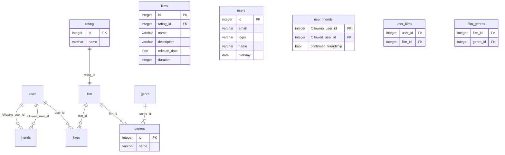

# java-filmorate

```mermaid
erDiagram
user ||--o{ friends : following_user_id
    user ||--o{ friends : followed_user_id
    user ||--o{ likes : user_id
    film ||--o{ likes : film_id
    film ||--|{ genres : film_id
    genre ||--|{ genres : genre_id
    rating ||--|| film : rating_id

    films {
        integer id PK
        integer rating_id FK
        varchar name
        varchar description
        date release_date
        integer duration
    }
    users {
        integer id PK
        varchar email
        varchar login
        varchar name
        date birthday
    }
    rating {
        integer id PK
        varchar name
    }
    user_friends {
        integer following_user_id FK
        integer followed_user_id FK
        bool confirmed_friendship
    }
    user_films {
        integer user_id FK
        integer film_id FK
    }
    film_genres {
        integer film_id FK
        integer genre_id FK
    }
    genres {
        integer id PK
        varchar name
    }
```
