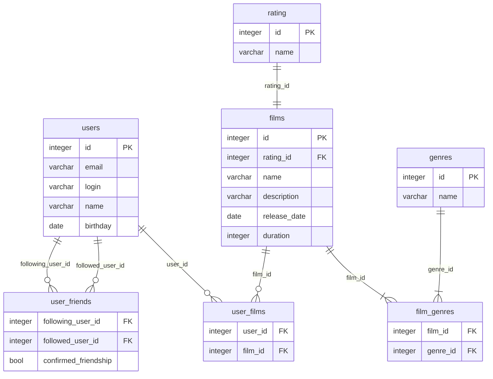

# java-filmorate

```mermaid
erDiagram
    users ||--o{ user_friends : following_user_id
    users ||--o{ user_friends : followed_user_id
    users ||--o{ user_films : user_id
    films ||--o{ user_films : film_id
    films ||--|{ film_genres : film_id
    genres ||--|{ film_genres : genre_id
    rating ||--|| films : rating_id

    films {
        integer id PK
        integer rating_id FK
        varchar name
        varchar description
        date release_date
        integer duration
    }
    users {
        integer id PK
        varchar email
        varchar login
        varchar name
        date birthday
    }
    rating {
        integer id PK
        varchar name
    }
    user_friends {
        integer following_user_id FK
        integer followed_user_id FK
        bool confirmed_friendship
    }
    user_films {
        integer user_id FK
        integer film_id FK
    }
    film_genres {
        integer film_id FK
        integer genre_id FK
    }
    genres {
        integer id PK
        varchar name
    }
```
